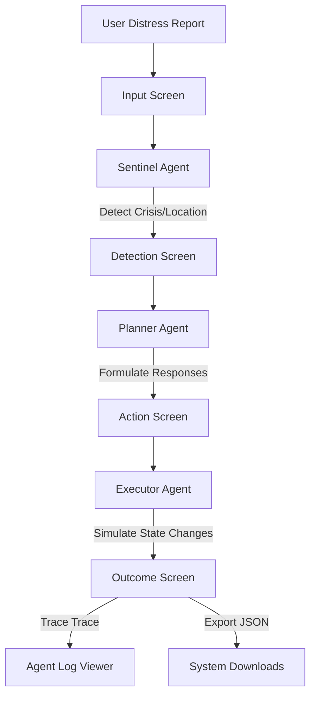

# AIDEN - Crisis Intelligence & Response Orchestrator

[](https://ai.google.dev/antigravity)
[](https://developer.android.com)
[](https://kotlinlang.org)

**AIDEN** (AI-powered Intelligent Disaster & Emergency Network) is an agentic AI-driven crisis response orchestrator designed for Android. It ingests natural language distress reports in English or Roman Urdu, flags active weather/traffic feeds, classifies disasters, designs responses, and simulates mitigation outcomes using three independent agents.

Developed for the **Google Antigravity Hackathon 2026 - Challenge 3: Crisis Intelligence & Response Orchestrator (CIRO)**.

---

## Key Features

*   **Multi-Lingual NLP Analysis**: Seamlessly handles Roman Urdu (e.g., *"G-10 mein pani bhar gaya hai"*) and English inputs.
*   **Three-Agent Pipeline**:
    1.  **Sentinel Agent**: Incident classifier, location parser, and impact analyzer.
    2.  **Planner Agent**: Generates actionable, prioritized mitigation checklists.
    3.  **Executor Agent**: Simulates response outcomes, calculating state improvements.
*   **Realistic Map & Metric Visualizations**: Shows clear before/after crisis parameter states and overlays dispatch units on a stylized sector grid canvas.
*   **Interactive Simulation Dashboard**: Runs actions step-by-step or in bulk, computing instant metric adjustments.
*   **Console Logging Engine**: Stores traces in memory, showing reasoning details using monospace console fonts, and supports JSON exports to the system's `Downloads` folder.
*   **Robust Local Fallback**: Seamlessly falls back to regular keyword expressions if no Gemini API key is configured or when offline.

---

## Architecture & Flow



---

## Design System

AIDEN adheres strictly to Compose Material 3 UI specifications. It utilizes a custom warm aesthetic styled around terracotta, sand, and earthy tones with **no blue or neon colors**:

*   **Primary Accent**: Terracotta (`#E76F51`)
*   **Secondary Accent**: Warm Sand (`#F4A261`)
*   **Surface Color**: Pure White (`#FFFFFF`)
*   **Background Color**: Warm White (`#FDF8F5`)
*   **Typography**: Playfair Display (Headers), Inter (Body text), and DM Sans (Metadata) via Downloadable Fonts.
*   **Terminal Font**: JetBrains Mono for system log outputs.

---

## Project Directory Structure

```text
AIDEN/
├── app/
│   ├── build.gradle.kts
│   └── src/main/java/com/muhammadkaleemakhtar/aiden/
│       ├── MainActivity.kt               # Entrypoint, Navigation Host
│       ├── agents/                       # Multi-agent Pipeline
│       │   ├── AgentLogger.kt            # Trace log recorder
│       │   ├── SentinelAgent.kt          # Emergency detection agent
│       │   ├── PlannerAgent.kt           # Action planner agent
│       │   └── ExecutorAgent.kt          # State simulation agent
│       ├── data/                         # Mock API & Local DB
│       │   ├── models/                   # Data class definitions
│       │   ├── mock/                     # Traffic, Weather, Social feeds
│       │   └── database/                 # CrisisStateDatabase singleton
│       ├── ui/                           # Layouts & Themes
│       │   ├── theme/                    # Color, Type, Theme files
│       │   ├── components/               # Cards, Log view, Progress bars
│       │   ├── screens/                  # Four primary wizard panels
│       │   └── navigation/               # Transitions & Routes
│       └── utils/                        # Networking & Files Exporters
├── docs/                                 # Architectural Documentation
│   ├── SETUP_GUIDE.md                    # Installation details
│   └── API_REFERENCE.md                  # Modules reference
├── local.properties                      # Developer settings (Gemini API key)
└── MASTER_PLAN.md                        # Project requirements index
```

---

## Setup and Installation

Refer to the complete [SETUP_GUIDE.md](file:///d:/CodeProjects/AndroidProjects/AIDEN/docs/SETUP_GUIDE.md) for details.

### 1. Add Gemini API Key
Open your `local.properties` file in the project root and add your API Key from [Google AI Studio](https://aistudio.google.com/):
```properties
GEMINI_API_KEY=AIzaSyYourGeminiApiKeyHere
```

### 2. Build via Command Line
Run the following commands in the root of the project to check compilation:
```powershell
# Set compilation environment (Windows)
$env:JAVA_HOME="C:\Program Files\Android\Android Studio\jbr"
./gradlew assembleDebug
```

---

## How to Run Verification

1.  Connect your phone or run an Emulator.
2.  In Android Studio, click **Run** (`Shift+F10`).
3.  Submit a report (e.g. `"G-10 sector is flooded due to heavy rains"`) on the first screen.
4.  Proceed through Detection, Action simulations, and inspect the before/after comparisons on the Outcome screen.
5.  Click the top-right information button to export the JSON logs to your local `Downloads` directory.
